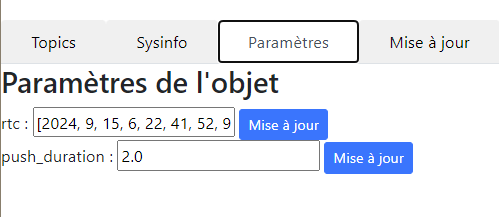

[](https://github.com/FredThx/FmPyIOT/blob/master/readme.md)[](https://github.com/FredThx/FmPyIOT/blob/master/readme_FR.md)

# projet Fmpyiot

For micropython IOT project on microcontrolers.

t's an evolution of https://github.com/FredThx/nodemcu_iot

but in micropython (and no longer in Lua)

The idea is to have a common library to manage connected objects based on microcontrollers (raspberry pi pico, esp32, ...) compatible with micropython.

Communications are via WIFI + MQTT.

Optional: http access

## General

A project is described in a main.py file, which describes how it works.

Example

```python
from devices.mydevice import MyDevice

from fmpyiot.fmpyiot import FmPyIot
from fmpyiot.topics import Topic

mydevice = Mydevice()

iot = FmPyIot(  
    mqtt_host = "....",
    mqtt_base_topic = "....",
    ssid = '....',
    password = "....",
    watchdog = 100,
    sysinfo_period = 600,
    led_incoming = None,
    led_wifi = None,
    web=True,
    web_credentials=("login", "password"),
    name = "FmPyIot TEST",
)
# In synchronous mode (fast sensor reading)
ma_mesure = Topic("./ma_mesure", read=lambda topic, payload : mydevice.read(), send_period=60)
iot.add_topic(ma_mesure)

# In asynchronous mode (if sensor reading is long, or for styling purposes)
async def co_mesure():
    #Long traitement
    await asyncio.sleep(3)
    return 42
iot.add_topic(Topic('/CO_TEST', read = co_mesure))

iot.run()
```

## Installation

- Install micropython on your µcontroller.
- Uploader [/lib]()
- Uploader [/FmPyIot]()
- create an empty ``boot.py`` file
- create a ``main.py`` file as shown above

  - with MQTT broker IP
  - SSID and pass of your WIFI network
  - ...
  - create topics
  - add topics
  - create parameters
  - boot the µc

## Description

### MAGICS TOPICS

### Les topics system

#### ./SYSINFO

Returns system data

```json
{"ifconfig":["192.168.10.77","255.255.255.0","192.168.10.254","192.168.10.169"],"uname":["rp2","rp2","1.21.0","v1.21.0 on 2023-10-06 (GNU 13.2.0 MinSizeRel)","Raspberry Pi Pico W with RP2040"],"mac":"28:cd:c1:0f:4d:81","wifi":{"ssid":"WIFI_THOME2","channel":3,"txpower":31},"mem_free":119504,"mem_alloc":57776,"statvfs":[4096,4096,212,118,118,0,0,0,0,255]}
```

### ./PARAMS

Return parameters

### ./SET_PARAM

Allows parameters to be modified.

#### Reverse topic

For each “TOPIC” topic, a reverse topic is generated: “TOPIC_”, which forces the topic to be sent.

If a topic is intended as an outgoing message (e.g. reading a sensor), then a topic can be used to force the reading of this value.

If a topic is scheduled as an incoming message (e.g. execution of an action), then a topic is created to retrieve the action's return value (e.g. “OK” or a value).

|                      | MQTT entrant | MQTT sortant                       |
| -------------------- | ------------ | ---------------------------------- |
| Topic read "./TEMP"  | ./TEMP_      | ./TEMP                             |
| Topic action "./LED" | ./LED        | ./LED_ (if action returns a value) |
| Topic system SYSINFO | SYSINFO_     | SYSINFO                            |

## Web server

### View Topic values / Execute actions


### view system information


### modify parameters



### Upload/download files


### have a REPL console


### a small system menu


## API

the microcontroller and the web browser communicate via this API:

Security: BasicAutentification

|                               | Method          | url                                                                                                | params                                                                     | output                                                |
| ----------------------------- | --------------- | -------------------------------------------------------------------------------------------------- | -------------------------------------------------------------------------- | ----------------------------------------------------- |
| HTML code for topics          | GET             | /api/topics                                                                                        |                                                                            | code HTML de la page topics                           |
| IOT status                    | GET             | /api/status                                                                                        |                                                                            | json de sysinfo                                       |
| List files                    | GET             | /api/ls                                                                                            |                                                                            | json:``json {'files' : ['main.py', 'boot.py', ....}`` |
| Download file                 | GET             | /api/download/{nom du fichier}                                                                     |                                                                            |                                                       |
| Delete file                   | DELETE          | /api/delete/{nom_fichier}                                                                          |                                                                            | 200, OK                                               |
| Upload file                   | PUT             | /api/upload/{nom_fichier}}                                                                         | fichier binary                                                             | 201, Created                                          |
| Reboot                        | GET&#124; POST | /api/reboot                                                                                        |                                                                            | 200, Ok                                               |
| Put µc on bootloader mode    | GET&#124; POST | /api/bootloader                                                                                    |                                                                            | 200, Ok                                               |
| Execute an action for a topic | POST            | /api/action/{topic_id}<br />``topic_id = "T"+re.sub(r'\W','_',self.topic)``                       | json:``json {'topic' : ..., 'payload':...}``<br />topic is often optional | 200,OK                                                |
| last REPL lines              | GET             | /api/repl                                                                                          |                                                                            | json:``json {"repl" : ['...', '...', ...]}``          |
| Execute python statement      | POST            | /api/repl/cmd                                                                                      | json:``json {"cmd" : "print(f'Hello {iot.name}')"}``                       | json:``json {"rep": ""}``                            |
| Set logging level             | POST            | /api/logging-level/{level}<br />level = 10 (DEBUG), 20(INFO), 30(WARNING), 40(ERROR), 50(CRITICAL) |                                                                            | 200, OK                                               |
| Hello                         | GET             | /api/hello                                                                                         |                                                                            | "FmPyIOT"""                                           |
| Return logfile content        | GET             | /api/logs                                                                                          |                                                                            |                                                       |
| list of parameters            | GET             | /api/param                                                                                         |                                                                            |                                                       |

# Thanks

[https://github.com/hugokernel/micropython-nanoweb]()

[https://github.com/peterhinch/micropython-mqtt]()
