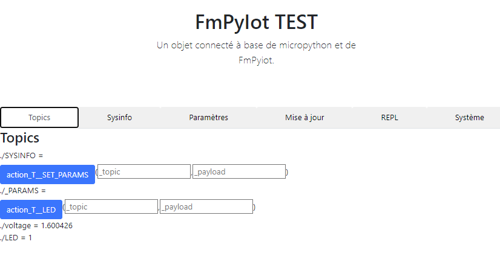

# projet Fmpyiot

Pour Fred, micropython IOT

C'est une évolution de https://github.com/FredThx/nodemcu_iot

mais en micropython (et non plus en Lua)

L'idée est d'avoir une libriairie commune pour gérer des objects connectés à base de microcontroleur (raspberry pi pico, esp32, ...) compatibles avec micropython.

Ensuite, les communications se font en WIFI + MQTT.

En option : accès en http

## Principes

Un projet se décrit à partir d'un fichier main.py dans lequel on va décrire son fonctionement

Exemple

```python
from devices.mydevice import MyDevice

from fmpyiot.fmpyiot import FmPyIot
from fmpyiot.topics import Topic

mydevice = Mydevice()

iot = FmPyIot(  
    mqtt_host = "....",
    mqtt_base_topic = "....",
    ssid = '....',
    password = "....",
    wotchdof = 100,
    watchdog=100,
    sysinfo_period = 600,
    led_incoming = None,
    led_wifi = None,
    web=True,
    web_credentials=("login", "password"),
    name = "FmPyIot TEST",
)
# En mode synchrone (lecture du capteur rapide)
ma_mesure = Topic("./ma_mesure", read=lambda topic, payload : mydevice.read(), send_period=60)
iot.add_topic(ma_mesure)

# En mode asynchrone (si la lecture du capteur est longue, ou pour le style)
async def co_mesure():
    #Long traitement
    await asyncio.sleep(3)
    return 42
iot.add_topic(Topic('/CO_TEST', read = co_mesure))

iot.run()
```

## Description

### MAGICS TOPICS

### Les topics system

#### ./SYSINFO

Renvoie les données system

```json
{"ifconfig":["192.168.10.77","255.255.255.0","192.168.10.254","192.168.10.169"],"uname":["rp2","rp2","1.21.0","v1.21.0 on 2023-10-06 (GNU 13.2.0 MinSizeRel)","Raspberry Pi Pico W with RP2040"],"mac":"28:cd:c1:0f:4d:81","wifi":{"ssid":"WIFI_THOME2","channel":3,"txpower":31},"mem_free":119504,"mem_alloc":57776,"statvfs":[4096,4096,212,118,118,0,0,0,0,255]}
```

### ./PARAMS

Renvoie les paramètres

### ./SET_PARAM

Permet de modifier les paramètres.

#### Reverse topic

Pour chaque topic "TOPIC", un reverse topic est généré : "TOPIC_" qui force l'envoie du topic.

Si un topic est prévu en message sortant (ex : lecture d'un capteur), alors un topic permet de forcer la lecture de cette valeur.

Si un topic est prévu en message entrant (ex : l'execution d'une action), alors un topic est créé pour récupérer la valeur de retour de l'action (ex : "OK" ou une valeur)

|                      | MQTT entrant | MQTT sortant                          |
| -------------------- | ------------ | ------------------------------------- |
| Topic read "./TEMP"  | ./TEMP_      | ./TEMP                                |
| Topic action "./LED" | ./LED        | ./LED_ (si action renvoie une valeur) |
| Topic system SYSINFO | SYSINFO_     | SYSINFO                               |

## Serveur web

### Visualiser les valeurs des Topics / Exécuter les actions



### visualiser les informations system


### Modifier des paramètres (todo)

### Upload/download les fichiers


### avoir une console REPL


### un petit menu system


# Thanks

[https://github.com/hugokernel/micropython-nanoweb]()

[https://github.com/peterhinch/micropython-mqtt]()
